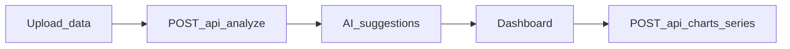

# Frontend — Análisis al Instante

Aplicación **React (Vite)** para el flujo de carga de hojas de cálculo, visualización de **sugerencias de gráficos** generadas por el backend (Gemini) y montaje de un **dashboard** con series agregadas vía API (sin descargar el dataset completo al navegador).

## Stack y decisiones

| Elección | Motivo |
| --- | --- |
| **React 19 + TypeScript + Vite 8** | HMR rápido, build moderna, tipado en cliente y contratos alineados con el OpenAPI del backend. |
| **React Router** | Landing pública (`/`) y portal con rutas de trabajo bajo un layout compartido. |
| **Recharts** | Gráficos a partir de los puntos que devuelve `POST /api/charts/series`. |
| **Framer Motion** | Transiciones ligeras en pantallas clave. |
| **XMLHttpRequest (`xhr.upload`)** | Avance por bytes (`ProgressEvent.loaded` / `total`) escalado a **1–95 %** durante la subida; los eventos se agrupan con **`requestAnimationFrame`** para no saturar renders; si el navegador no expone `total`, se estima con el tamaño del `File`. El **100 %** solo tras respuesta JSON del backend (perfilado + Gemini + persistencia). |

## Variables de entorno

Copie [.env.example](.env.example) a `.env` y complete según necesite:

- `VITE_API_URL` — origen del backend FastAPI **sin** barra final (p.ej. `http://localhost:8000`). Si se omite, el cliente usa `http://localhost:8000` por defecto.
- `VITE_AUTHOR_PORTFOLIO_URL`, `VITE_AUTHOR_LINKEDIN_URL`, `VITE_AUTHOR_GITHUB_URL` — enlaces opcionales para el pie de la landing; pueden dejarse vacíos.

Solo las variables que empiezan por `VITE_` se inyectan en el bundle

## Integración con la API

El cliente llama al mismo contrato descrito en [`backend-dashboard-creator/README.md`](../backend-dashboard-creator/README.md):

| Método | Ruta (relativa al `VITE_API_URL`) | Uso en el frontend |
| --- | --- | --- |
| `POST` | `/api/analyze` | `multipart/form-data` con campo `file`; devuelve `upload_id` y `suggestions`. Usado en la pantalla de carga con progreso (`analyzeSpreadsheetWithProgress`). |
| `POST` | `/api/charts/series` | JSON con `upload_id`, `chart_type` y `parameters`; devuelve filas listas para Recharts (`fetchChartSeries`). |

En el backend, `CORS_ORIGINS` debe incluir el origen de Vite (por defecto `http://localhost:5173`).

## Rutas y navegación

| Ruta | Pantalla |
| --- | --- |
| `/` | Inicio (landing). |
| `/upload-data` | Cargar archivo `.csv` / `.xlsx` e iniciar análisis. |
| `/ai-suggestions` | Tarjetas con sugerencias de la IA; añadir al dashboard. |
| `/dashboard` | Cuadrícula de gráficos con datos agregados. |
| `/settings` | Vista tipo Stitch: preview de columnas y tipos (sin persistencia en backend). |
| `/export-report` | Vista tipo Stitch: configuración de exportación (sin generación real de PDF). |

## Estado global del flujo

`AnalysisFlowProvider` (`src/context/AnalysisFlowContext.tsx`) concentra `uploadId`, sugerencias, *widgets* del dashboard, progreso de análisis y errores. Tras un análisis exitoso navega automáticamente a `/ai-suggestions`. Un **reset** de sesión limpia `uploadId`, sugerencias y widgets para empezar otro archivo.



## Assets desde Google Stitch (opcional)

El script `npm run fetch:stitch` descarga capturas y HTML de referencia según `scripts/stitch-manifest.json` hacia `src/assets/stitch/` y `public/stitch-html/`. Requiere `curl` disponible en el PATH (en Windows usa `curl.exe`).

## Ejecución local

Desde la carpeta **`frontend-dashboard-creator`** (donde está este `README`):

```powershell
cd frontend-dashboard-creator
npm install
```

```powershell
npm run dev
```

Abra la app en `http://localhost:5173` (puerto por defecto de Vite).

### Otros comandos

| Comando | Descripción |
| --- | --- |
| `npm run build` | Typecheck (`tsc -b`) y build de producción en `dist/`. |
| `npm run preview` | Sirve `dist/` para validar el build. |
| `npm run lint` | ESLint sobre el proyecto. |

### Comprobaciones rápidas

1. Tener el backend en marcha (`uvicorn` en el puerto configurado en `VITE_API_URL`).  
2. En `/upload-data`, subir un CSV de prueba y confirmar redirección a sugerencias.  
3. Añadir una sugerencia al dashboard y comprobar que los gráficos cargan sin error de red.

## Estructura útil del código

| Ruta | Rol |
| --- | --- |
| `src/api/http.ts`, `src/api/analysis.ts` | Origen de la API, errores FastAPI y llamadas a analizar / series. |
| `src/types/api.ts` | Tipos alineados con las respuestas JSON del backend. |
| `src/config/nav.ts` | Constantes de rutas y elemento de navegación del portal. |
| `src/features/*` | Pantallas por flujo (home, upload, sugerencias, dashboard, etc.). |
| `src/layouts/portal/*` | Shell del área autenticada de trabajo (sidebar, header). |
